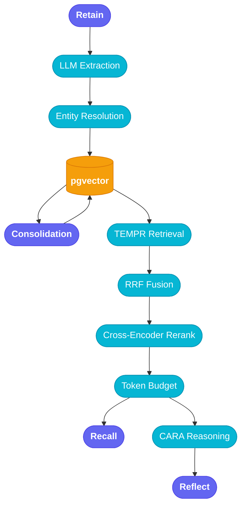

<h1 align="center">elephant 🐘</h1>

<p align="center">
  Long-term memory for AI agents.<br>
  Structured extraction · entity resolution · temporal reasoning · preference tracking.
</p>

<p align="center">
  <a href="https://arxiv.org/abs/2512.12818"></a>
  <a href="#quick-start"></a>
  
  
</p>

<p align="center"><b>91.2% accuracy</b> on <a href="bench/locomo/README.md">LoCoMo</a> (1,540 questions, 10 conversations, Cat.1–4)</p>

<p align="center">
  <a href="#quick-start">Quick Start</a> · <a href="#how-it-works">How It Works</a> · <a href="#features">Features</a> · <a href="#benchmarks">Benchmarks</a>
</p>

<br>

Most memory systems are a vector store with a prompt. Elephant is a full extraction and reasoning pipeline built in Rust — it pulls structured facts out of conversations, resolves entities across sessions, tracks preferences with confidence scores, and synthesizes answers conditioned on what it actually knows about you.

## Quick Start

Copy `.env.example` to `.env`, set your `LLM_API_KEY`, and:

```sh
cp .env.example .env
docker compose up -d
```

Store a memory:

```sh
curl localhost:3001/v1/retain -d '{
  "bank_id": "demo",
  "content": "Alice joined Acme Corp in March 2024. She prefers Rust over Go."
}'
```

Ask a question:

```sh
curl localhost:3001/v1/reflect -d '{
  "bank_id": "demo",
  "query": "When did Alice join her company and what role?"
}'
```

### MCP

The same server speaks [MCP](https://modelcontextprotocol.io/) natively. Point any MCP client at it:

```json
{
  "mcpServers": {
    "elephant": {
      "type": "streamable-http",
      "url": "http://localhost:3001/mcp"
    }
  }
}
```

Five tools: **retain** · **recall** · **reflect** · **list_banks** · **create_bank**

### Building from source

Requires Postgres 16 + pgvector, ONNX Runtime 1.23, and local models for embeddings and reranking. See [`tests/README.md`](tests/README.md) for setup instructions.

```sh
cargo run --release
```

Full config reference in [`.env.example`](.env.example). `LLM_PROVIDER` supports `anthropic`, `openai`, and `openai-responses`.

Optional prompt caching is supported for Anthropic, OpenAI Chat Completions, and OpenAI Responses. Enable it with `LLM_PROMPT_CACHE_ENABLED=1`; OpenAI also supports optional `OPENAI_PROMPT_CACHE_KEY` and `OPENAI_PROMPT_CACHE_RETENTION`, and Anthropic supports `ANTHROPIC_PROMPT_CACHE_TTL`.

### Vendored docs

The Rust API Guidelines are vendored into this repo under [`docs/vendor/rust-api-guidelines`](docs/vendor/rust-api-guidelines), with the book source in [`docs/vendor/rust-api-guidelines/src`](docs/vendor/rust-api-guidelines/src).

To update the vendored copy:

```sh
git fetch rust-api-guidelines
git subtree pull --prefix=docs/vendor/rust-api-guidelines rust-api-guidelines master --squash
```

## How It Works



**Retain** extracts structured facts via LLM, resolves entities, and stores them across four memory networks (world, experience, observation, opinion). **Recall** runs four parallel retrieval channels (semantic, keyword, graph, temporal), fuses with RRF, reranks with a cross-encoder, and trims to a token budget. **Reflect** reasons over retrieved context with preference-conditioned synthesis.

→ [Full architecture](docs/architecture.md)

## Features

- **Four memory networks** — world facts, experiences, observations, opinions
- **TEMPR retrieval** — four channels fused with RRF, cross-encoder reranking
- **CARA reasoning** — preference-conditioned answer synthesis
- **Entity resolution** — cross-session deduplication via embeddings + LLM verification
- **Consolidation** — merges related facts into observations, detects and reconciles opinions
- **Local or cloud** — ONNX embeddings or OpenAI; Anthropic or OpenAI for LLM
- **MCP + REST** — single server, PostgreSQL + pgvector

## Benchmarks

### [LoCoMo](bench/locomo/README.md)

Long-context conversational memory (ACL 2024). Full 10-conversation benchmark (series1), 1,540 questions across categories 1–4:

| Category | Accuracy | n |
|:--|:-:|--:|
| **Open-domain** | 93.8% | 841 |
| **Multi-hop** | 92.5% | 321 |
| **Single-hop** | 90.4% | 282 |
| **Temporal** | 66.7% | 96 |
| **Overall** | **91.2%** | **1,540** |

<sub>Sonnet 4.6 · bge-small-en-v1.5 local embeddings · <a href="bench/locomo/protocol.md">protocol</a> · <a href="bench/locomo/result-card.md">result card</a></sub>

### [LongMemEval](bench/longmemeval/README.md)

Long-term memory evaluation (Wu et al., 2024). 500 questions testing five core abilities — information extraction, multi-session reasoning, knowledge updates, temporal reasoning, and abstention — each with its own conversation history.

<sub>Results pending first full run · <a href="bench/longmemeval/README.md">setup & usage</a></sub>

## References

- [Hindsight](https://arxiv.org/abs/2512.12818) — the memory architecture Elephant implements
- [LoCoMo](https://arxiv.org/abs/2402.17753) — the LoCoMo benchmark dataset
- [LongMemEval](https://arxiv.org/abs/2410.10813) — the LongMemEval benchmark dataset
