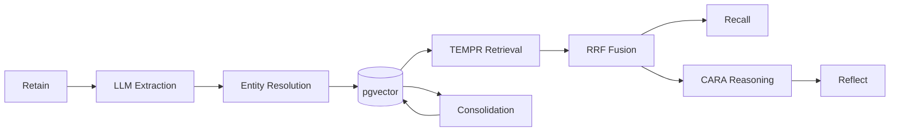

# Architecture

## Pipeline

## Memory Networks

| Network | Purpose | Example |
|---|---|---|
| **World** | Objective facts | "PostgreSQL supports JSONB" |
| **Experience** | Personal events | "Alice joined Acme in 2024" |
| **Observation** | Synthesized summaries | Merged facts about an entity |
| **Opinion** | Subjective beliefs | Confidence-scored preferences |

## Consolidation

Consolidation can be triggered to:

1. **Observation synthesis** — groups related facts about the same entity, merges them into a single summary, and stores it as an observation memory.
2. **Opinion detection** — identifies subjective beliefs and preferences, scores them with a confidence level, and stores them as opinion memories.
3. **Mental models** — generates cross-cutting summaries ("pinned reflections") that stay current by periodically re-running their source query through reflect.

Consolidation uses the same LLM as retain (overridable via `RETAIN_LLM_MODEL`). It can be disabled per-request or globally.

## Retrieval (TEMPR)

TEMPR fuses five retrieval signals using reciprocal rank fusion:

- **T**emporal — recency-weighted scoring
- **E**ntity — entity-graph traversal
- **M**eaning — embedding similarity (pgvector cosine distance)
- **P**reference — opinion/preference matching
- **R**ecency — access-time boosting

## Reasoning (CARA)

Reflect uses CARA (Context-Aware Reasoning Architecture) to condition synthesis on user preferences and dispositions. The reflect prompt includes recalled opinions and preferences alongside factual memories, producing answers that respect the user's stated views.
