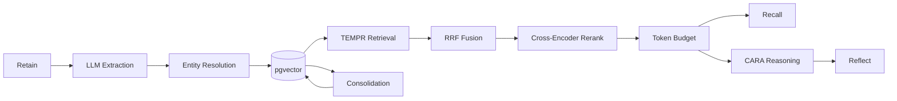

# Architecture

## Pipeline

## Memory Networks

| Network | Purpose | Example |
|---|---|---|
| **World** | Objective facts | "PostgreSQL supports JSONB" |
| **Experience** | Personal events | "Alice joined Acme in 2024" |
| **Observation** | Synthesized summaries | Merged facts about an entity |
| **Opinion** | Subjective beliefs | Confidence-scored preferences |

## Consolidation

Consolidation runs two steps:

1. **Observation synthesis** — groups related facts about the same entity, merges them into a single summary, and stores it as an observation memory.
2. **Opinion merging** — clusters similar opinions by embedding similarity, classifies them as consistent/contradictory/superseded, and merges or weakens accordingly.

Consolidation uses the reflect-tier LLM (overridable via `REFLECT_LLM_MODEL`). Each step is triggered independently via the API.

## Retrieval (TEMPR)

TEMPR (**T**emporal **E**ntity **M**emory **P**riming **R**etrieval) runs four parallel retrieval channels, fuses them with RRF, then refines with a cross-encoder:

1. **Semantic** — embedding similarity (pgvector cosine distance)
2. **Keyword** — BM25 full-text search
3. **Graph** — entity-graph spreading activation
4. **Temporal** — date-range matching and recency scoring

Results are merged via Reciprocal Rank Fusion (k=60), reranked by a cross-encoder (ms-marco-MiniLM-L-6-v2), then trimmed to a token budget.

## Reasoning (CARA)

Reflect uses CARA (Context-Aware Reasoning Architecture) to condition synthesis on user preferences and dispositions. The reflect prompt includes recalled opinions and preferences alongside factual memories, producing answers that respect the user's stated views.
